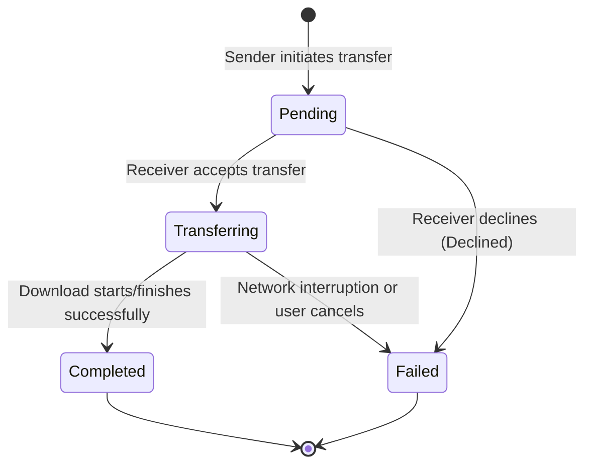

# Data Model: Local Quick Share

This document describes the in-memory data structures managed by the Node.js server to coordinate devices and transfers.

## Core Entities

### 1. Peer Device
Represents a client device connected to the local sharing server.

| Field | Type | Description | Validation |
|---|---|---|---|
| `id` | String | Unique UUID v4 identifying the device session | Required, must be a valid UUID v4 |
| `name` | String | User-customizable display name of the device | Required, length: 1–32 chars, sanitized |
| `deviceType` | String | Detected device category (`desktop`, `mobile`, `tablet`) | Required, must match one of the categories |
| `ipAddress` | String | Local IP address of the device | Required, valid IPv4 or IPv6 format |
| `lastSeen` | Number | Epoch timestamp (ms) of the last heartbeat received | Required, positive integer |
| `online` | Boolean | Connection status | Required |

---

### 2. Transfer Session
Represents an active or historical file or text transfer session.

| Field | Type | Description | Validation |
|---|---|---|---|
| `id` | String | Unique transfer ID | Required, valid UUID v4 |
| `senderId` | String | The ID of the sender `Peer Device` | Required, must exist in peer list |
| `receiverId` | String | The ID of the recipient `Peer Device` | Required, must exist in peer list |
| `type` | String | The payload category (`file` or `text`) | Required, value: `file` or `text` |
| `status` | String | The current state of the transfer | Required, see State Transitions below |
| `fileName` | String | Original name of the file (file only) | Required for file, length: 1–255 chars, sanitized |
| `fileSize` | Number | Size of the file in bytes (file only) | Required for file, maximum 104,857,600 bytes (100MB) |
| `fileType` | String | MIME type of the file (file only) | Optional, sanitized string |
| `textPayload` | String | Content of the shared text (text only) | Required for text, length: 1–10,000 chars |
| `progress` | Number | Transmission percentage (0 to 100) | Required, float between 0.0 and 100.0 |
| `tempFilePath` | String | Internal filesystem path to buffered file | Required for file, valid filesystem path |
| `createdAt` | Number | Timestamp of transfer creation | Required, positive integer |

---

## State Transitions

### Transfer Session Status Lifecycle

The status of a `Transfer Session` transitions through the following states:

### State Definitions

1. **Pending**: The transfer has been initiated by the sender, and the server is waiting for the receiver's consent.
2. **Transferring**: The receiver accepted the transfer, and the file binary data is being streamed/buffered.
3. **Completed**: The file data has been successfully written to the temporary directory and served to the receiver, or the text snippet has been successfully delivered.
4. **Failed**: The transfer was interrupted, cancelled, or declined by the receiver.

---

## Validation Rules

1. **File Size Enforcement**:
   - Before accepting any binary upload stream, the server checks the `Content-Length` header or the incoming file metadata. If it exceeds `104,857,600` bytes (100MB), the server MUST reject the transfer with a `413 Payload Too Large` status.
2. **Name Sanitization**:
   - All customizable device names must be stripped of HTML tags, control characters, and leading/trailing whitespace.
3. **Stale Peer Cleanup**:
   - The server regularly checks the `lastSeen` timestamp of all peers. Any peer that hasn't sent a heartbeat/SSE-keep-alive within 15 seconds is marked `offline: true`, broadcasted to other peers, and purged from active memory after 1 minute of inactivity.
